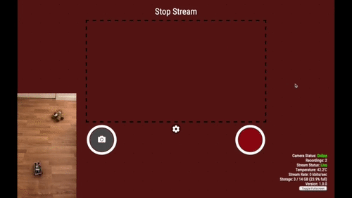
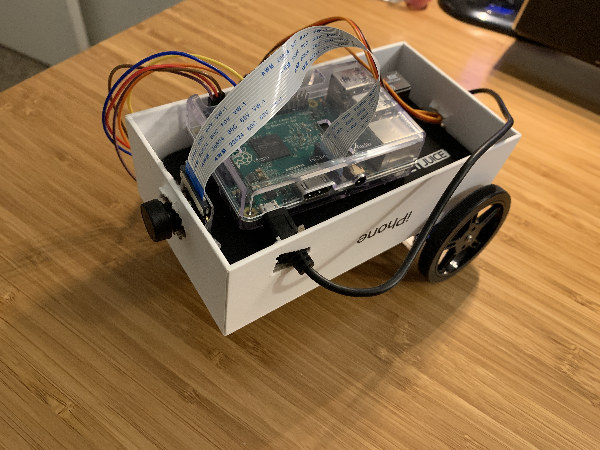

[](https://github.com/benbusby/raztot/releases/)
[](https://github.com/benbusby/raztot/blob/main/LICENSE)
[](https://github.com/benbusby/raztot/actions/workflows/build.yml)

The RazTot is an easy DIY project that allows you to remotely control a roving security camera securely from your browser.



*Note: This is an old gif using the previous UI, but the functionality is the same. The current UI is a lot less cluttered.*

*For a build guide of the original RazTot with pictures, you can visit [the imgur album for the project here](https://imgur.com/a/DZqkBm9).*

## Browser Support (Latest Versions)

| [](http://godban.github.io/browsers-support-badges/)</br>Edge | [](http://godban.github.io/browsers-support-badges/)</br>Firefox | [](http://godban.github.io/browsers-support-badges/)</br>Chrome | [](http://godban.github.io/browsers-support-badges/)</br>Safari | [](http://godban.github.io/browsers-support-badges/)</br>iOS Safari |
| --------- | --------- | --------- | --------- | --------- |
| :heavy_check_mark:| :heavy_check_mark:| :heavy_check_mark:| :heavy_check_mark:| :heavy_check_mark:|

## Features
- Video streaming
- Servo control for moving around on wheels or aiming the camera
- Cutting edge HTML
- Bleeding edge CSS
- Oxidizing edge Rust performance
- Everything else you could ever want

## Parts

| Part | Description | Price
| --- | --- | --- |
| 1 x Raspberry Pi | The main component of the RazTot. I personally recommend getting one that comes with at an SD card and a case (although a case isn't *completely* necessary, I suppose). One that comes with built in WiFi is a good idea as well, otherwise you'll need a WiFi USB stick. | $15-55 |
| 1 x Raspberry Pi Camera | Required for streaming video. | [~$12](https://www.amazon.com/Arducam-Megapixels-Sensor-OV5647-Raspberry/dp/B012V1HEP4/) |
| 2 x servos (with wheels) | These are used to control movement of the RazTot. | [$15](https://www.amazon.com/Feetech-Degree-Continuous-Rotation-Arduino/dp/B079MF1BZS/) |
| 1 x portable power block | Required in order to move around without needing to be plugged into a wall all the time. I use [this one](https://www.amazon.com/gp/product/B0742NFNN9/) since it comes with a fold out AC wall plug, which (in my opinion) is more convenient to charge when it dies, and the 12000mAh version lasts me quite a while. | Price varies ([mine was $24](https://www.amazon.com/gp/product/B0742NFNN9/)) |
| 6 x M->F jumper wires | Needed for connecting the servos to the Raspberry Pi | [~$5](https://www.amazon.com/Breadboard-Wires-Jumper-Multicolored-Raspberry/dp/B01GK2Q4ZQ/ref=sr_1_13?crid=9U5LVMLCC1J6&keywords=m%2Ff+jumper+wires&qid=1560054378&s=gateway&sprefix=m+to+f+jumper+%2Caps%2C186&sr=8-13) |
| (Optional, but recommended) 1 x mounting surface | Can be 3D printed, or just using materials at your disposal (I used an iPhone box I had lying around). This provides a way to mount the wheels on something without doing any mods to your battery pack. I guarantee one of the boxes that the parts are shipped to you in will work for this. | Varies, can be free |
| (Optional) 1 x 1" caster wheel | This can be used towards the front of the mounting surface to help guide the RazTot. Although you only need one, they generally come in a set. You can most likely use something like a tennis ball cut in half to mount in the front instead. | Varies ([mine were $10](https://www.amazon.com/SungMi-Plastic-Capacity-Included-SM-AMS-210001/dp/B07DS6SF14/), but can be found for cheaper.) |

**Total:** ~$80-120, depending on parts

*Can be made cheaper with a smaller/lower mAh batter, buying cheaper caster wheels, opting for the Raspberry Pi Zero, etc. I haven't tried a build with the Pi Zero, but I imagine it works about the same (though maybe a little slower).*

## Setup / Installation
### Hardware Setup
#### Camera
To set up the camera, you just insert the non-camera end of the camera's ribbon cable into the connector between the HDMI and Ethernet ports (if not using the Pi Zero). There's a small tab you pull up on to allow the cable to slide into the connector, and then push back in once the cable is in place.

Once the camera is connected, run:
```bash
vcgencmd get_camera
```

You should see ```supported=1 detected=1``` in the output of the command if the camera was connected properly.

#### Servos
The main component that needs setting up is servo support for the RazTot. This is pretty straightforward and just requires a single package and some male->female jumper cables.

The package you'll need to control the servos is called [pigpio](https://abyz.me.uk/rpi/pigpio/). You can [download it here](https://abyz.me.uk/rpi/pigpio/download.html).

Once you have the library downloaded, start the pigpio daemon with `sudo pigpiod`.

___

Now to connect the actual servos to the Pi!

Each motor has three wires: ground, power, and signal. For the servos I purchased, the corresponding colors for these were brown, red, and yellow. If you purchased different servos, make sure to look up what the proper colors are on your model.

Take three jumper cables and plug the male side into the slots for each wire. With the female side of the cable, attach it to [the correct GPIO pins on the Raspberry Pi](https://pinout.xyz/#).

Using that pin layout, the power cable for each wheel should go in the top right two pins labelled "5V". The ground cables can go on any pin labelled "Ground" in that diagram. The signal cables can go to any of the BCM pins that don't have labels next to them in parentheses. Keep track of which wire is going where, otherwise the wheels probably won't work. Repeat for the other wheel and you're good to go!

Once you're done, you can use pigpio to check if your motors are working properly.

```bash
pigs SERVO 22 1000 # Send clockwise pwm command to servo 22
pigs SERVO 17 2000 # Send counterclockwise pwm command to servo 17
pigs SERVO 22 0 # Stop servo 22
pigs SERVO 17 0 # Stop servo 17
```
*Note: You should have the motors positioned so that the wheel isn't in contact with a surface. Otherwise the wheels will roll around while they're being tested.*

#### IMPORTANT
If you don't use pins 17 and 22, you will need to update your environment variables to reflect the correct pins when you're actually using the RazTot:
```bash
export SERVO_L=<L pin>
export SERVO_R=<R pin>
```

### Software Setup

You can either [download the RazTot executable here](https://github.com/benbusby/raztot/releases/download/v2.0.0/raztot-ARMv7) or build the app manually:

(manual build instructions coming soon)

Once you have the RazTot executable on your Pi, run the following commands to launch the app:

```bash
sudo pigpiod # Only if the daemon isn't already running
raspivid -ISO 0 -t 0 -n -o - -w 640 -h 480 -fps 90 -b 25000000 -cd MJPEG -hf -vf | ./path/to/raztot-ARMv7
```

The app should now be live on `0.0.0.0:5000`, and you'll be able to control the device with your arrow keys (if you also set up servo support).

## Misc
#### First Build


For more images, see [the Imgur album](https://imgur.com/a/DZqkBm9).

## Credits
- RazTot logo by [Ren Chu](https://artbyren.com) ([Instagram](https://instagram.com/art.by.ren))
